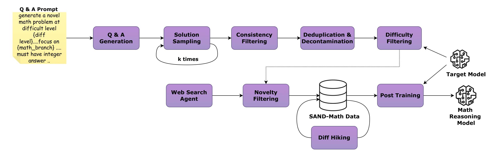

# 🚀 Scalable Synthetic Data Pipeline for SOTA Reasoning Model

<div align="center">

[](https://arxiv.org/pdf/2507.20527)
[](https://huggingface.co/your-org)
[](https://huggingface.co/datasets/your-org)
[](LICENSE)

</div>

## 📖 Overview

Building State-of-the-Art (SOTA) reasoning models is traditionally a resource-heavy marathon requiring massive compute clusters and proprietary datasets. **This repository democratizes that process.**

We introduce a complete ecosystem—pipeline, dataset, and training code—that allows you to build reasoning models rivalling **Qwen3-32B** performance using purely synthetic data and standard Supervised Fine-Tuning (SFT). All experiments were conducted efficiently on the **AMD Instinct™ ROCm™** stack (MI300X GPUs).

This repository contains:
1.  **`pipeline/`**: A fully automated pipeline to generate difficult synthetic problems.
2.  **`training/`**: SFT scripts taken from `LLama-Factory`.
3.  **`eval/`**: Evaluation scripts for AIME, MATH500, and GPQA Taken from `LIMO` code repo.

---

## 🔗 Models & Datasets

We are releasing our curated dataset and two best-performing models trained using this pipeline.

| Type | Name | Description | Link |
| :--- | :--- | :--- | :--- |
| **Model** | **SAND-Math-Qwen2.5-32B** | SOTA Math reasoner trained on 14k synthetic samples. | [🤗 HuggingFace](https://huggingface.co/your-org/SAND-Math-Qwen2.5-32B) |
| **Model** | **SAND-MathScience-DS32B** | Math & Science reasoner matching Qwen3 performance. | [🤗 HuggingFace](https://huggingface.co/your-org/SAND-MathScience-DS32B) |
| **Dataset** | **SAND-Reasoning-26k** | 14k Math & 12k Science high-difficulty synthetic problems. | [🤗 HuggingFace](https://huggingface.co/datasets/your-org/SAND-Reasoning-26k) |

---

## 🧠 The Synthetic Data Pipeline

The core contribution of this work is a 4-stage automated pipeline that prioritizes **quality over quantity**. Unlike datasets that recycle easy problems, our pipeline leverages a Teacher Model (`GPT-OSS120b`) to generate, validate, and systematically "hike" the difficulty of reasoning problems.

<div align="center">
  
</div>

### Pipeline Stages

1.  **Stage 1: QA Generation & Consistency** 🛠️
    *   Generates novel problems from scratch.
    *   Enforces correctness by requiring the teacher to generate multiple independent solution paths; only questions where all answers align are kept.

2.  **Stage 2: De-duplication & Decontamination** 🧹
    *   Removes internal duplicates via embedding similarity.
    *   **Crucial Step:** Scans against known test sets (AIME, MATH, GPQA) to ensure zero contamination.

3.  **Stage 3: Difficulty Filtering** 📉
    *   A "Solver" model attempts every question.
    *   If the solver gets it right, the question is **discarded**. We only keep problems that the baseline model *cannot* currently solve.

4.  **Stage 4: Difficulty Hiking** 🏔️
    *   Remaining questions are rewritten by the Teacher model to introduce deeper reasoning chains, added constraints, and cross-domain logic.

---

## 📊 Results

We conducted two major experiments to validate the pipeline.

### Unlocking Reasoning Abilities in Qwen2.5-32B
Using only **14k synthetic math samples** and standard SFT (no RL), we achieved a massive performance jump, outperforming models trained using significantly larger datasets generated using other approaches.

| Model | Data Size | AIME24 | AIME25 | MATH500 | GPQA |
| :--- | :--- | :--- | :--- | :--- | :--- |
| Qwen2.5-32B-Instruct (Base) | - | 16.7 | 13.3 | 83.4 | 53.5 |
| DeepSeek-R1-Distill-Qwen-32B | 800k | 72.6 | 54.9 | 94.3 | 62.1 |
| Light-R1-32B | 79k | 73.0 | 64.3 | 93.3 | 60.6 |
| OpenThinker-32B | 114k | 66 | 53.3  | 89.4  | 57.6 |
| **SAND-Math-Qwen2.5-32B (Ours)** | **14k** | **74.01** | **68.18** | **92.05** | **60.8** |

### Bridging the Generational Gap
We fine-tuned `DeepSeek-R1-Distill-Qwen-32B` which is based on the previous-generation `Qwen2.5-32B` on a mixed dataset of **14k Math + 12k Science**. The result is a model that rivals the next-generation **Qwen3-32B**.

| Model | Data Size | AIME24 | AIME25 | MATH500 | GPQA |
| :--- | :--- | :--- | :--- | :--- | :--- |
| EXAONE Deep 32B | - | 72.1 | 65.8 | 95.8 | 66.1 |
| Qwen3-32B (Thinking mode) | - | 81.4 | 72.9 | **97.0** | 68.4 |
| **SAND-MathScience-DS32B (Ours)** | **26k** | **81.61** | **74.79** | 94.25 | **68.24** |

> **Note:** Our approach proves that targeted, high-difficulty synthetic data can elevate prior-generation models to match modern proprietary systems efficiently.

***

## 🛠️ Getting Started


### 1. QuickStart: Data Pipeline

The pipeline is designed to be modular. You can run the entire flow from generation to training preparation using the scripts in the `pipeline` folder.

First, lets setup the environment, We recommend using the official ROCm vLLM Docker container to ensure all AMD drivers and libraries are correctly configured.

```bash
docker run -it \
  --ipc=host \
  --network=host \
  --device=/dev/kfd \
  --device=/dev/dri \
  --security-opt seccomp=unconfined \
  --group-add video \
  --shm-size 32G \
  -w /workspace \
  rocm/vllm-dev:open-mi300-08052025
```

Next, clone the repository:
```bash
git clone https://github.com/your-username/repo_name.git
cd repo_name/pipeline
```

Install some required additional packages to run the pipeline

```bash
pip install requirements.txt
```

**Step 1: Launch Inference Server (Teacher Model)**
Before generating data, you must start the vLLM server with the teacher model (e.g., `gpt-oss-120b`). Run the following command in a separate terminal or background process:

```bash
export VLLM_ROCM_USE_AITER=1
export VLLM_USE_AITER_UNIFIED_ATTENTION=1
export VLLM_ROCM_USE_AITER_MHA=0

vllm serve openai/gpt-oss-120b \
    --tensor-parallel 8 \
    --port 8080 \
    --max-num-seqs 4096 \
    --max-model-len 52072 \
    --max-num-batched-tokens 65536 \
    --gpu-memory-utilization 0.90 \
    --no-enable-prefix-caching \
    --disable-log-requests \
    --enable-chunked-prefill \
    --compilation-config '{"full_cuda_graph": true}'
```

**Step 2: Data Generation**

for math data generation:

Once the server is up and listening on given port number ex, 8087, run the generation script to create raw question-answer pairs:
```bash
python datageneration.py \
    --run_name "math" \
    --model_name "openai/gpt-oss-120b" \
    --port 8080 \
    --output_dir "data" \
    --max_concurrency 256 \
    --batch_size 512 \
    --max_questions 4096
```

for science:
```bash
python datageneration_science.py \
    --run_name "science" \
    --model_name "openai/gpt-oss-120b" \
    --port 8080 \
    --output_dir "data" \
    --max_concurrency 256 \
    --batch_size 512 \
    --max_questions 4096
         
```
**Step 3: Consistency Filtering**

Verify correctness by ensuring the teacher model generates consistent answers across multiple attempts.
```bash
python consistencycheck.py \
    --input_files data/generated_qa_math.jsonl \
    --output_file data/consistent_math.jsonl \
    --report_file data/report_math_consistency.jsonl \
    --model meta-llama/Llama-3.3-70B-Instruct
```

**Step 4: Decontamination**

Remove samples that overlap with benchmarks (AIME, GPQA, etc.).
Update the inputs paths required at the begining of the script, inside the script.
```bash
python decontamination.py
```

**Step 5: Deduplication**

Remove semantically identical questions from the dataset.
Update the inputs paths required at the begining of the script, inside the script.
```bash
python deduplication.py
```

**Step 6: Training Data Preparation**

Format the final cleaned dataset for the training framework.
```bash
python train_data_prep.py \
    --input_file data/consistent_dc_dd_math.jsonl \
    --output_file ../train/data/sand_math.json
```
> **Below are the optional steps for difficulty hiking of the less difficult questions and subsequently generating the solutions for them, abd including back to the training data**

**Step 7: Difficulty Rating**

Rate for the difficuly of the questions on a scale of 1-10
```bash
python diffrating.py \
    --input_file data/consistent_dc_dd_math.jsonl \
    --output_file data/consistent_dc_dd_math_diffrated.jsonl \
    --model meta-llama/Llama-3.3-70B-Instruct
```
**Step 8: Difficulty Hiking**

This step hikes the difficulty of the existing low difficul questions, create new difficult questions from them.

```bash
python diffhiking_guided.py \
    --input_file data/consistent_dc_dd_math_diffrated.jsonl \
    --output_file data/diffhiked_math.jsonl \
    --model_name "openai/gpt-oss-120b" \
    --port 8080 \
    --batch_size 2048 \
    --max_workers 512
```

**Step 9: Solution Generation**

Generate solutions for the difficulty hiked quetions

```bash
python solution_generation.py \
    --input_file data/diffhiked_math.jsonl \
    --output_file /data/diffhiked_solutions_math.jsonl \
    --model_name "openai/gpt-oss-120b" \
    --port 8080 \
    --batch_size 4096 \
    --max_workers 1024
```

---

### 3. Training

We use LLaMA-Factory for efficient fine-tuning on AMD hardware.

**1. Register the Dataset**
Copy your final processed data to the training folder and register it.
```bash
cp pipeline/data/generated_qa_math_final_formatted.jsonl train/data/
```
Open `train/data/dataset_info.json` and add an entry for your new file.

**2. Create Configuration**
Create a YAML configuration file in `train/examples/train_full/` (e.g., `qwen_finetune.yaml`). Define your model path, learning rate, and dataset name there.

**3. Launch Training**
Run the training job using the LLaMA-Factory CLI:

```bash
cd train
llamafactory-cli train examples/train_full/qwen_finetune.yaml
```

---

## 📜 License

This project is licensed under the **Open RAIL-MSD** license. This is an open, royalty-free license that permits commercial use, modification, and distribution of the dataset, models, and source code.

The license includes standard use-based restrictions to prevent harmful applications (e.g., illegal activities, generating harmful content, high-risk applications). These restrictions are designed to promote responsible AI development while keeping the license permissive for legitimate use cases.

For full license terms and conditions, please see the [LICENSE](LICENSE.txt) file
